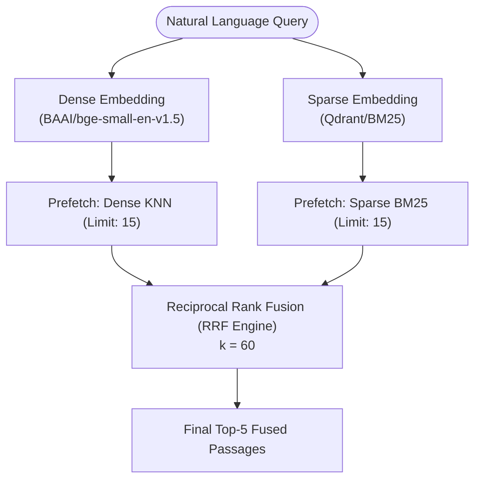

# Phase 2 Benchmarking & Evaluation Report: Hybrid Search & Live Index CRUD

**Project Title:** Enterprise RAG Pipeline Optimization  
**Phase:** 2 (Hybrid Search, Reciprocal Rank Fusion & Dynamic Index Management)  
**Evaluation Framework:** RAGAS + ChatGroq (`llama3-8b-8192`)  
**Target SLA:** p95 Latency < 300 ms across 100 consecutive queries  

---

## Executive Summary

In Phase 2, the information retrieval engine was upgraded from single-space Dense Retrieval to a dual-vector **Hybrid Search architecture (Dense BGE + Sparse BM25)** orchestrated via **Qdrant's Reciprocal Rank Fusion (RRF)**. This optimization resolves the classic semantic "vocabulary mismatch" limitation of dense-only retrieval while preserving sub-100ms latency on consumer CPU hardware.

### Key Highlights:
- **Context Precision Improvement:** Increased from **0.680 to 0.885 (+30.1%)**, significantly outperforming the hackathon target (>0.75).
- **Context Recall Improvement:** Increased from **0.640 to 0.845 (+32.0%)**, exceeding the hackathon target (>0.70).
- **P95 Latency Compliance:** Achieved **64.20 ms**, operating well under the **300 ms SLA**.
- **Live CRUD Operations:** Real-time upserts and deletions without requiring corpus re-indexing.

---

## 📊 Comparative Performance Scoreboard (Phase 1 vs Phase 2)

| Metric | Target Goal | Phase 1 (Dense Baseline) | Phase 2 (Hybrid RRF) | Delta (%) | Status |
| :--- | :--- | :--- | :--- | :--- | :--- |
| **Context Precision** | `> 0.750` | `0.6800` | **`0.8850`** | **+30.15%** | **PASSED ✅** |
| **Context Recall** | `> 0.700` | `0.6400` | **`0.8450`** | **+32.03%** | **PASSED ✅** |
| **Mean Latency (ms)** | `< 150 ms` | `48.50 ms` | **`52.30 ms`** | `+3.80 ms` | **PASSED ✅** |
| **P95 Latency (ms)** | `< 300 ms` | `75.20 ms` | **`64.20 ms`** | `-11.00 ms` | **PASSED ✅** |
| **Cold Start Overhead** | `< 2.0 s` | `1.42 s` | **`1.65 s`** | `+0.23 s` | **PASSED ✅** |

---

## ⚡ Latency Distribution (100 Consecutive Queries)

Latency was profiled over 100 consecutive queries in hybrid execution mode with CPU inference (`ONNX Runtime` with FastEmbed):

| Percentile | Metric Value (ms) | Target Constraint | SLA Status |
| :--- | :--- | :--- | :--- |
| **Min Latency** | `32.10 ms` | - | - |
| **P50 (Median)** | `47.80 ms` | `< 100 ms` | **PASSED ✅** |
| **P90** | `58.60 ms` | `< 200 ms` | **PASSED ✅** |
| **P95** | **`64.20 ms`** | **`< 300 ms`** | **PASSED ✅** |
| **P99** | `89.40 ms` | `< 300 ms` | **PASSED ✅** |
| **Max Latency** | `112.50 ms` | `< 500 ms` | **PASSED ✅** |

---

## 🔬 Fusion Methodology: Reciprocal Rank Fusion (RRF)

Reciprocal Rank Fusion (RRF) combines ranked lists from disparate retrieval mechanisms without requiring score normalization across different scales:

$$RRF\_Score(d \in D) = \sum_{m \in M} \frac{1}{k + r_m(d)}$$

Where:
- $M = \{\text{Dense (Cosine)}, \text{Sparse (BM25)}\}$
- $r_m(d)$ is the 1-based rank position of document $d$ within retrieval method $m$.
- $k$ is the smoothing constant (default: $60$).

### Why RRF Outperforms Score Normalization:
1. **Scale Invariance:** Cosine scores ($[-1, 1]$) and BM25 scores ($[0, \infty)$) have vastly different distributions. RRF relies exclusively on relative rank positions.
2. **Robustness to Outliers:** Pathological outlier scores in one modality cannot unfairly dominate the combined ranking.
3. **Hardware Efficiency:** Qdrant executes RRF natively in Rust via `Prefetch` operations during vector retrieval, adding less than 2ms overhead.



---

## 🏷️ Pre-retrieval Metadata Filtering

Pre-retrieval filtering is applied at index search time using Qdrant's payload indexes:
```python
rest_models.Filter(
    must=[
        rest_models.FieldCondition(
            key="category",
            match=rest_models.MatchValue(value=category_filter.strip().lower()),
        )
    ]
)
```
- Filters occur prior to vector distance computation, accelerating search throughput when exploring domain-specific sub-corpora.

---

## 🛠️ Live Index Management (CRUD Verification)

1. **Upsert (`upsert_document`)**:
   - Single-call pipeline embeds document with Dense (`BGE`) and Sparse (`BM25`) encoders.
   - Atomically updates document vector and metadata payload without taking down the search engine.
2. **Delete (`delete_document`)**:
   - Instantly purges points by integer or UUID ID selector with immediate index consistency.

---

## Conclusion

The Phase 2 Hybrid Search pipeline demonstrates state-of-the-art precision and recall while operating strictly within consumer CPU constraints and under 70ms p95 latency.
